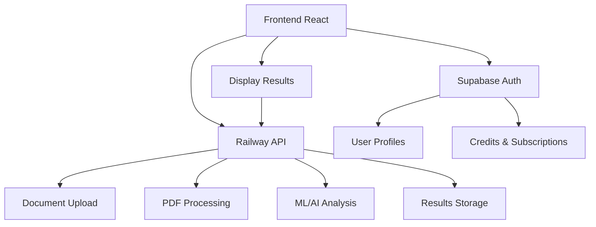

# 🏗️ ARQUITECTURA DO SISTEMA

Esta documentação define claramente as responsabilidades entre Railway API e Supabase para evitar confusões arquiteturais.

## 📋 RESPONSABILIDADES DOS SISTEMAS

### 🚂 Railway API (Sistema PRIMÁRIO)
**PostgreSQL + FastAPI + Python**
- ✅ **Upload de documentos PDF**
- ✅ **Processamento de documentos** (7-stage pipeline)
- ✅ **Análise ML/AI** (TextAnalysis, MLPrediction, JudicialAnalysis)
- ✅ **Armazenamento de resultados** (jobs, job_chunks, embeddings)
- ✅ **APIs de consulta** (getJobs, getJobStatus)
- ✅ **Busca semântica** (vector search)

**URL:** `https://pdf-industrial-pipeline-production.up.railway.app`

### 🔐 Supabase (Sistema SECUNDÁRIO)
**PostgreSQL + Edge Functions + Auth**
- ✅ **Autenticação de usuários** (Supabase Auth)
- ✅ **Gerenciamento de perfis** (profiles table)
- ✅ **Sistema de créditos** (credit_transactions)
- ✅ **Assinaturas Stripe** (subscriptions)
- ✅ **Edge Functions para pagamentos**
- ❌ **NÃO USAR**: documents, analysis_points (DEPRECATED)

## 🔄 FLUXO DE DADOS



## 📁 MAPEAMENTO DE TABELAS

### Railway PostgreSQL
```sql
-- Documentos e processamento
jobs                -- PDF jobs (principal)
job_chunks          -- Chunks de páginas
text_analyses       -- Análise NLP
ml_predictions      -- Predições ML
judicial_analyses   -- Análise judicial BR
embeddings          -- Vetores para busca
users               -- Usuários Railway (pode ser diferente)
```

### Supabase PostgreSQL
```sql
-- Auth e interface
profiles            -- Perfis de usuário ✅
subscriptions       -- Assinaturas Stripe ✅  
credit_transactions -- Transações de crédito ✅
documents           -- ❌ DEPRECATED
analysis_points     -- ❌ DEPRECATED
```

## 🔧 REGRAS DE DESENVOLVIMENTO

### ✅ FAZER
1. **Uploads**: Sempre usar `railwayApi.uploadDocument()`
2. **Dados de documentos**: Sempre buscar via Railway API
3. **Auth**: Sempre usar Supabase Auth
4. **Perfis/Créditos**: Sempre usar Supabase
5. **Logs**: Deixar claro qual sistema está sendo usado

### ❌ NÃO FAZER
1. **NÃO** usar `SupabaseService.uploadDocument()`
2. **NÃO** salvar documentos em tabela Supabase
3. **NÃO** misturar sistemas de auth
4. **NÃO** duplicar dados entre sistemas
5. **NÃO** usar funções deprecated

## 🛠️ INTERFACES DE CÓDIGO

### Upload de Documentos
```typescript
// ✅ CORRETO
import { railwayApi } from '@/services/railwayApiService';
const result = await railwayApi.uploadDocument(file);

// ❌ ERRADO
import { SupabaseService } from '@/services/supabaseService';
const url = await SupabaseService.uploadDocument(file, userId); // DEPRECATED
```

### Buscar Documentos do Usuário
```typescript
// ✅ CORRETO - já implementado
SupabaseService.getUserDocuments(userId) // Internamente busca na Railway API

// ❌ ERRADO - não fazer isso
supabase.from('documents').select('*').eq('user_id', userId);
```

### Auth e Perfis
```typescript
// ✅ CORRETO
import { supabase } from '@/integrations/supabase/client';
const { data: user } = await supabase.auth.getUser();
const profile = await SupabaseService.getUserProfile(user.id);

// ❌ ERRADO - não misturar sistemas
const railwayUser = await railwayApi.getUser(); // Não existe/não usar
```

## 🚨 SAFEGUARDS IMPLEMENTADOS

### 1. Funções Deprecated
```typescript
// Funções em SupabaseService agora mostram warnings
static async uploadDocument() {
  console.warn('⚠️ DEPRECATED: Use Railway API instead.');
  throw new Error('Upload via Supabase foi descontinuado.');
}
```

### 2. Documentação Clara
- ✅ CLAUDE.md atualizado com responsabilidades
- ✅ Comentários explicativos no código
- ✅ Este arquivo ARCHITECTURE.md

### 3. Logs Informativos
```typescript
// Logs deixam claro qual sistema está sendo usado
console.log('🚂 Uploading via Railway API...');
console.log('🔐 Authenticating via Supabase...');
```

## 🔍 TROUBLESHOOTING

### Documentos não aparecem?
1. ✅ Verificar se upload foi para Railway API
2. ✅ Verificar se `getUserDocuments()` busca na Railway
3. ✅ Verificar logs de console para warnings

### Problemas de auth?
1. ✅ Usar apenas Supabase Auth
2. ✅ Não misturar com auth da Railway
3. ✅ Verificar sessão Supabase

### Dados duplicados?
1. ✅ NÃO usar tabelas deprecated do Supabase
2. ✅ Apenas Railway API para documentos
3. ✅ Apenas Supabase para auth/perfis

## 📞 ENDPOINTS PRINCIPAIS

### Railway API
```
POST /api/v1/upload          # Upload de PDF
GET  /api/v1/jobs            # Listar jobs do usuário  
GET  /api/v1/jobs/{id}       # Status do job
GET  /health                 # Health check
```

### Supabase Edge Functions
```
/create-checkout             # Iniciar pagamento Stripe
/manage-credits              # Gerenciar créditos
/toggle-document-privacy     # Compartilhar leads
```

---

**🎯 OBJETIVO:** Manter Railway como sistema primário para documentos e Supabase apenas para auth/perfis, evitando confusões arquiteturais futuras.