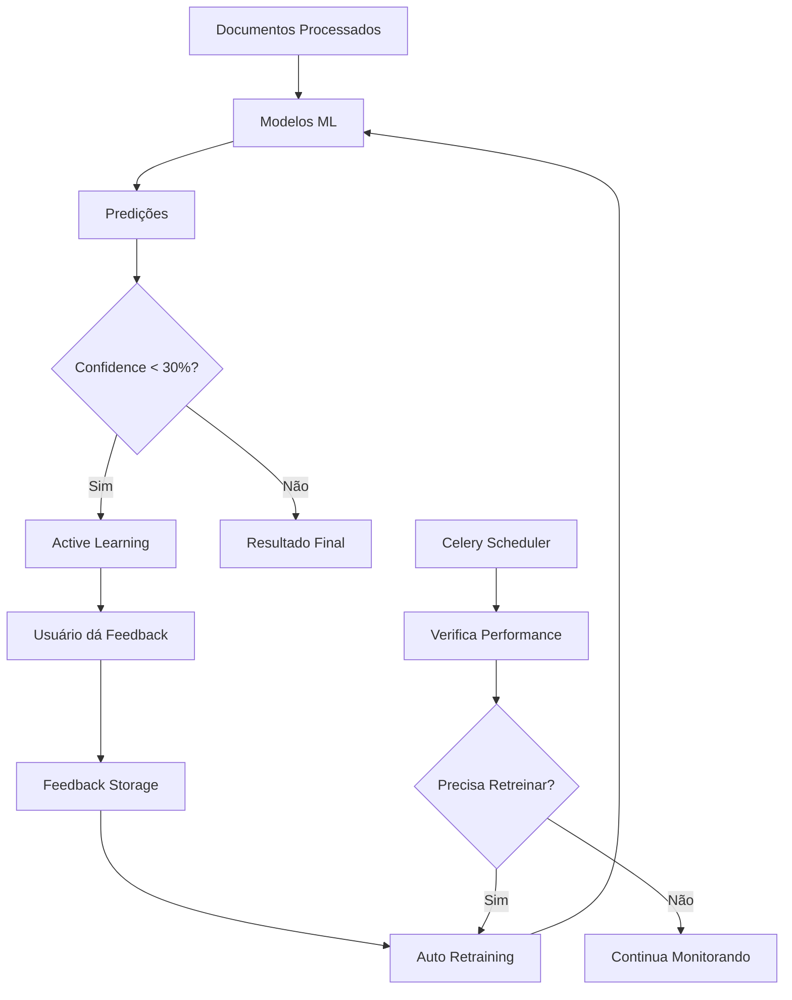

# 🧠 SISTEMA DE INTELIGÊNCIA ML

Documentação completa do sistema de Machine Learning inteligente que fica mais esperto automaticamente.

## 📋 VISÃO GERAL

O PDF Industrial Pipeline possui um sistema de ML que:
- 🤖 **Retreina automaticamente** quando necessário
- 🎯 **Pergunta ao usuário** quando tem dúvida (Active Learning)
- 🔄 **Incorpora feedback humano** no treinamento
- 📊 **Monitora performance** e melhora continuamente

## 🏗️ ARQUITETURA



## 🔧 COMPONENTES

### 1. Auto Retraining System
**Arquivo:** `apps/api/ml_engine/auto_retraining.py`

**Funcionalidades:**
- Verifica diariamente se modelos precisam ser retreinados
- Retreina quando:
  - ≥50 novos documentos processados
  - Performance < 85%
  - >30 dias sem retreinamento

**Uso:**
```python
from ml_engine.auto_retraining import run_auto_retraining

# Executa verificação automática
result = run_auto_retraining()
```

### 2. Active Learning System
**Arquivo:** `apps/api/ml_engine/active_learning.py`

**Funcionalidades:**
- Identifica predições com baixa confidence
- Gera perguntas específicas para usuários
- Coleta feedback estruturado

**Uso:**
```python
from ml_engine.active_learning import ActiveLearningSystem

active_learner = ActiveLearningSystem()
uncertain_cases = active_learner.identify_uncertain_predictions(db, limit=10)
```

### 3. Feedback Integration System
**Arquivo:** `apps/api/ml_engine/feedback_integration.py`

**Funcionalidades:**
- Converte feedback humano em labels de treino
- Pesos diferenciados (feedback humano = 2x peso)
- Retreinamento automático com feedback acumulado

**Uso:**
```python
from ml_engine.feedback_integration import run_feedback_enhanced_retraining

# Retreina modelo usando feedback dos usuários
result = run_feedback_enhanced_retraining('random_forest_classifier')
```

## ⏰ AUTOMAÇÃO CELERY

### Schedules Configurados

**Arquivo:** `apps/api/celery_app.py`

```python
beat_schedule = {
    'auto-retraining-check': {
        'task': 'tasks.ml_tasks.run_auto_retraining',
        'schedule': 86400.0,  # Diário
    },
    'identify-uncertain-predictions': {
        'task': 'tasks.ml_tasks.identify_uncertain_cases', 
        'schedule': 21600.0,  # A cada 6h
    },
    'process-pending-feedback': {
        'task': 'tasks.ml_tasks.process_feedback_batch',
        'schedule': 43200.0,  # A cada 12h
    },
    'model-performance-check': {
        'task': 'tasks.ml_tasks.check_model_performance',
        'schedule': 86400.0,  # Diário
    }
}
```

### Tasks Disponíveis

**Arquivo:** `apps/api/tasks/ml_tasks.py`

1. **`run_auto_retraining_task()`** - Verificação diária de retreinamento
2. **`identify_uncertain_cases_task()`** - Identifica casos incertos
3. **`process_feedback_batch_task()`** - Processa feedback acumulado
4. **`check_model_performance_task()`** - Monitora performance
5. **`manual_retrain_model_task()`** - Retreinamento manual

## 🌐 API ENDPOINTS

### Base URL: `/api/v1/ml`

**Arquivo:** `apps/api/api/v1/ml_intelligence.py`

#### 1. Predições Incertas
```http
GET /api/v1/ml/uncertain-predictions?limit=10
```
**Response:**
```json
[
  {
    "job_id": "uuid",
    "filename": "documento.pdf",
    "confidence": 0.25,
    "lead_score": 0.6,
    "uncertainty_reason": "Confidence baixa; Modelos discordam",
    "questions": [...]
  }
]
```

#### 2. Submeter Feedback
```http
POST /api/v1/ml/feedback
```
**Payload:**
```json
{
  "job_id": "uuid",
  "feedback": {
    "overall_quality": "4 - Bom",
    "would_invest": "Sim",
    "main_issue": "Boa oportunidade"
  }
}
```

#### 3. Estatísticas dos Modelos
```http
GET /api/v1/ml/model-stats
```
**Response:**
```json
{
  "models": [
    {
      "model_name": "random_forest_classifier",
      "performance": 0.87,
      "days_since_training": 5,
      "total_samples": 1250,
      "feedback_samples": 45
    }
  ],
  "feedback_statistics": {...}
}
```

#### 4. Retreinamento Manual
```http
POST /api/v1/ml/retrain/random_forest_classifier?include_feedback=true
```

#### 5. Insights de Aprendizado
```http
GET /api/v1/ml/learning-insights
```

#### 6. Status do Sistema
```http
GET /api/v1/ml/system-intelligence
```

## 📊 MODELOS UTILIZADOS

### 1. Random Forest Classifier
- **Arquivo:** `storage/models/random_forest_classifier/model.pkl`
- **Features:** 40 características extraídas
- **Uso:** Classificação de qualidade de leads

### 2. Gradient Boosting Regressor  
- **Arquivo:** `storage/models/gradient_boosting_regressor/model.pkl`
- **Features:** 40 características extraídas
- **Uso:** Score contínuo de viabilidade

### Features Principais
```json
[
  "text_length", "word_count", "entity_count",
  "cnpj_count", "phone_count", "email_count",
  "has_financial_values", "max_financial_value",
  "judicial_auction_score", "legal_compliance_score",
  "investment_viability_score", "risk_level_score",
  "property_valuation_indicators", "lang_pt"
]
```

## 🔄 FLUXO DE FEEDBACK

### 1. Identificação de Incerteza
```python
# Sistema identifica predições incertas
if prediction.confidence < 0.3:
    create_feedback_request(job_id)
```

### 2. Coleta de Feedback
```python
# Frontend solicita feedback do usuário
feedback_data = create_active_learning_request(job_id)
# Usuário responde perguntas
user_feedback = collect_user_responses(feedback_data.questions)
```

### 3. Processamento
```python
# Sistema converte feedback em score
score = calculate_score_from_feedback(user_feedback)
# Armazena para retreinamento
save_feedback_to_file(job_id, score, user_feedback)
```

### 4. Retreinamento
```python
# Quando acumula 20+ feedbacks
if feedback_count >= 20:
    retrain_with_feedback(model_name)
```

## 📈 MÉTRICAS DE PERFORMANCE

### Métricas Coletadas
- **Accuracy:** Taxa de acerto das predições
- **Confidence:** Confiança média das predições
- **User Satisfaction:** Rating médio dos usuários
- **Investment Intention:** % usuários que investiriam
- **Model Disagreement:** Divergência entre modelos ensemble

### Thresholds de Alerta
- Performance < 85% → Retreinamento automático
- Confidence < 30% → Active learning request
- Disagreement > 20% → Sinalizar para revisão

## 🗂️ ARMAZENAMENTO DE DADOS

### Feedback Storage
```
storage/feedback/
├── feedback_202501.jsonl          # Feedback atual
└── processed/
    └── feedback_202501_processed_20250111_143022.jsonl
```

### Model Storage
```
storage/models/
├── random_forest_classifier/
│   ├── model.pkl                   # Modelo treinado
│   ├── scaler.pkl                  # Normalizador
│   └── metadata.json               # Histórico de treino
└── gradient_boosting_regressor/
    ├── model.pkl
    ├── scaler.pkl
    └── metadata.json
```

## 🔧 COMANDOS ÚTEIS

### Executar Manualmente
```bash
# Verificar se precisa retreinar
python -c "from ml_engine.auto_retraining import run_auto_retraining; print(run_auto_retraining())"

# Identificar casos incertos
python -c "from ml_engine.active_learning import ActiveLearningSystem; print(ActiveLearningSystem().identify_uncertain_predictions(db, 5))"

# Ver estatísticas de feedback
python -c "from ml_engine.feedback_integration import FeedbackIntegrationSystem; print(FeedbackIntegrationSystem().get_feedback_statistics())"
```

### Celery Workers
```bash
# Iniciar worker
celery -A celery_app worker --loglevel=info

# Iniciar scheduler
celery -A celery_app beat --loglevel=info

# Monitorar tasks
celery -A celery_app flower
```

## 🎯 ROADMAP

### Próximas Funcionalidades
1. **Drift Detection** - Detectar mudanças na distribuição dos dados
2. **Multi-Armed Bandit** - Otimização automática de hyperparâmetros
3. **Ensemble Voting** - Combinação inteligente de múltiplos modelos
4. **Feature Selection** - Seleção automática de features relevantes
5. **Anomaly Detection** - Detectar documentos atípicos

### Melhorias Planejadas
1. **Dashboard ML** - Interface visual para monitoramento
2. **A/B Testing** - Comparação entre versões de modelos
3. **Explainability** - Explicações detalhadas das predições
4. **Real-time Learning** - Aprendizado em tempo real
5. **Multi-objective Optimization** - Otimizar múltiplas métricas

---

**🚀 Este sistema transforma seu negócio em uma máquina de aprendizado contínuo, onde cada documento processado e cada feedback do usuário contribui para melhorar a inteligência artificial!**