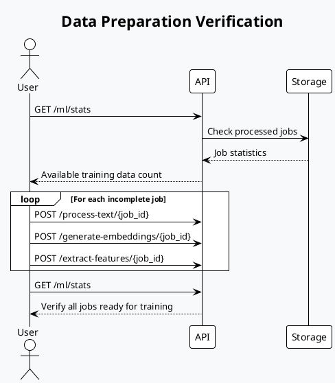
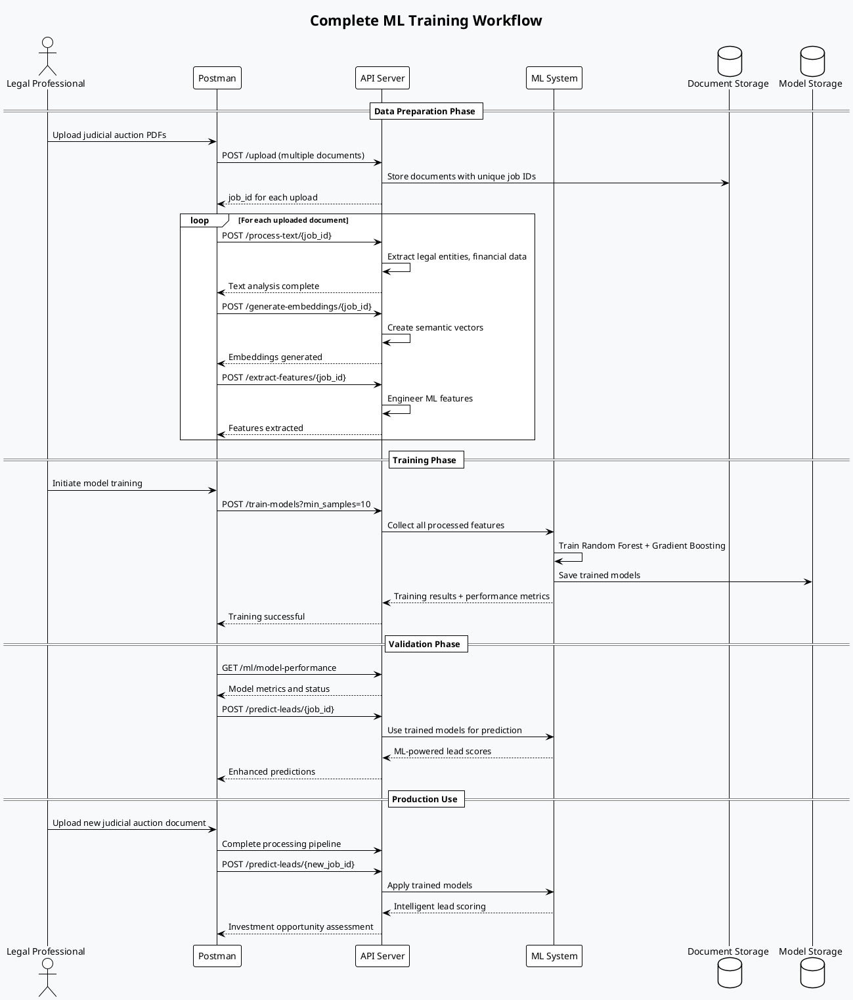

# Model Training Tutorial - Brazilian Judicial Auction Analysis

## 📚 **Complete Guide to Training ML Models for Lead Scoring**

This tutorial provides step-by-step instructions for training machine learning models in your Brazilian judicial auction analysis system. The models will learn to identify high-value investment opportunities in judicial auction documents.

---

## 🎯 **What You'll Learn**

- How the ML training process works
- Step-by-step training workflow
- Postman collection setup for training endpoints
- Understanding model performance and improvement
- Best practices for data preparation

---

## 🧠 **How Machine Learning Works in Your System**

### **Learning Process Overview**

Your system uses **supervised learning** where models learn from examples:

1. **Input**: Processed judicial auction documents with extracted features
2. **Training**: Models learn patterns between document features and lead scores
3. **Output**: Trained models that can predict lead quality for new documents

### **Models Used**

1. **Random Forest Classifier** (60% weight)
   - Classifies leads as High/Medium/Low quality
   - Good for understanding feature importance
   
2. **Gradient Boosting Regressor** (40% weight)
   - Predicts numerical scores (0-100)
   - Excellent for fine-grained scoring

3. **Ensemble Model**
   - Combines both models for best accuracy
   - Weighted average of predictions

---

## 📋 **Prerequisites**

### **Data Requirements**
- **Minimum**: 10 processed documents (you have 13+ ✅)
- **Recommended**: 20+ documents for better accuracy
- **Optimal**: 50+ documents for production-ready models

### **Document Processing Pipeline**
Each document must go through the complete pipeline:
```
Upload → Text Processing → Embeddings → Feature Extraction → Ready for Training
```

---

## 🔄 **Training Process Flow**

```plantuml
@startuml Training Process Flow
!theme plain
skinparam backgroundColor #f8f9fa
skinparam defaultFontSize 12

actor User as U
participant "API Server" as API
participant "ML Worker" as ML
participant "Feature Engineer" as FE
participant "Random Forest" as RF
participant "Gradient Boosting" as GB
participant "Storage" as S

title Machine Learning Model Training Process

U -> API: POST /train-models?min_samples=10
activate API

API -> ML: train_models(min_samples=10)
activate ML

ML -> S: Load all processed job features
activate S
S --> ML: Return features + scores from all jobs
deactivate S

alt Insufficient Data
    ML --> API: {"status": "insufficient_data", "samples_found": N}
    API --> U: Need more processed documents
else Sufficient Data
    ML -> FE: Convert features to DataFrame
    activate FE
    FE --> ML: Structured training data (X, y)
    deactivate FE
    
    par Random Forest Training
        ML -> RF: train(features, target_scores)
        activate RF
        RF -> RF: Split data (80% train, 20% test)
        RF -> RF: Fit RandomForestClassifier
        RF -> RF: Cross-validation (3-fold)
        RF -> RF: Calculate metrics (accuracy, precision, recall)
        RF --> ML: ModelPerformance + trained model
        deactivate RF
    and Gradient Boosting Training
        ML -> GB: train(features, target_scores)
        activate GB
        GB -> GB: Split data (80% train, 20% test)
        GB -> GB: Fit GradientBoostingRegressor
        GB -> GB: Cross-validation (3-fold)
        GB -> GB: Calculate metrics (RMSE, R²)
        GB --> ML: ModelPerformance + trained model
        deactivate GB
    end
    
    ML -> ML: Create ensemble with weighted models
    ML -> S: Save trained models to storage/models/
    activate S
    S --> ML: Models saved successfully
    deactivate S
    
    ML --> API: {"status": "completed", "performances": {...}}
    API --> U: Training successful with metrics
end

deactivate ML
deactivate API

@enduml
```

---

## 🚀 **Step-by-Step Training Tutorial**

### **Step 1: Verify System Status**

First, check if your server is running and healthy:

**Postman Request:**
```
GET {{base_url}}/health
```

**Expected Response:**
```json
{
  "status": "healthy",
  "timestamp": "2025-06-23T10:30:00Z"
}
```

### **Step 2: Check Available Training Data**

Verify how much training data is available:

**Postman Request:**
```
GET {{base_url}}/ml/stats
```

**Expected Response:**
```json
{
  "message": "Estatísticas do sistema ML",
  "worker_stats": {
    "features_extracted": 13,
    "predictions_made": 0,
    "ensemble_trained": false
  },
  "available_jobs": 13
}
```

### **Step 3: Ensure All Jobs Are Fully Processed**

Check that jobs have completed the full pipeline:



**Postman Collection for Data Preparation:**

1. **Check Job Status**
   ```
   GET {{base_url}}/job/{{job_id}}/status
   ```

2. **Complete Processing (if needed)**
   ```
   POST {{base_url}}/process-text/{{job_id}}
   POST {{base_url}}/generate-embeddings/{{job_id}}
   POST {{base_url}}/extract-features/{{job_id}}
   ```

### **Step 4: Start Model Training**

Now train the models with your data:

**Postman Request:**
```
POST {{base_url}}/train-models?min_samples=5
```

**Request Body (Optional):**
```json
{
  "job_ids": null,
  "min_samples": 5
}
```

**Test Script:**
```javascript
pm.test("Training initiated successfully", function () {
    pm.response.to.have.status(200);
    const response = pm.response.json();
    
    if (response.status === "insufficient_data") {
        console.log("❌ Need more data:", response.message);
        console.log("Samples found:", response.samples_found);
        console.log("Required:", response.min_samples_required);
    } else if (response.message.includes("treinados com sucesso")) {
        console.log("✅ Training successful!");
        console.log("Models trained:", response.models_trained);
        console.log("Samples used:", response.samples_used);
        
        // Save training completion flag
        pm.environment.set("models_trained", "true");
    }
});
```

**Expected Success Response:**
```json
{
  "message": "Modelos treinados com sucesso",
  "models_trained": ["random_forest", "gradient_boosting"],
  "samples_used": 13,
  "performances": {
    "random_forest": {
      "model_name": "random_forest_classifier",
      "accuracy": 0.85,
      "cross_val_score": 0.82,
      "samples_trained": 10
    },
    "gradient_boosting": {
      "model_name": "gradient_boosting_regressor",
      "rmse": 12.5,
      "r2_score": 0.78,
      "samples_trained": 10
    }
  }
}
```

### **Step 5: Verify Training Success**

Check model performance and status:

**Postman Request:**
```
GET {{base_url}}/ml/model-performance
```

**Test Script:**
```javascript
pm.test("Models are trained and performing", function () {
    pm.response.to.have.status(200);
    const response = pm.response.json();
    
    console.log("🤖 Model Status:");
    console.log("Ensemble trained:", response.worker_statistics.ensemble_trained);
    console.log("Random Forest trained:", response.worker_statistics.random_forest_trained);
    console.log("Gradient Boosting trained:", response.worker_statistics.gradient_boosting_trained);
    
    pm.expect(response.worker_statistics.ensemble_trained).to.be.true;
});
```

### **Step 6: Test Trained Models**

Test the trained models with a prediction:

**Postman Request:**
```
POST {{base_url}}/predict-leads/{{job_id}}
```

**Test Script:**
```javascript
pm.test("ML predictions working", function () {
    pm.response.to.have.status(200);
    const response = pm.response.json();
    
    console.log("🎯 ML Prediction Results:");
    console.log("Total pages predicted:", response.total_pages);
    console.log("Average ML score:", response.statistics.average_ml_score);
    console.log("High quality leads:", response.statistics.high_quality_leads);
    
    // Verify we're getting real ML scores, not dummy ones
    pm.expect(response.statistics.average_ml_score).to.not.equal(50.0);
});
```

---

## 📊 **Understanding Model Performance**

### **Key Metrics Explained**

**Random Forest Classifier:**
- **Accuracy**: % of correct High/Medium/Low classifications
- **Cross-validation Score**: Model consistency across different data splits
- **Feature Importance**: Which document features matter most

**Gradient Boosting Regressor:**
- **RMSE**: Average prediction error (lower is better)
- **R² Score**: How well model explains data variance (higher is better)
- **Cross-validation Score**: Model reliability

### **Performance Benchmarks**

| Metric | Poor | Good | Excellent |
|--------|------|------|-----------|
| RF Accuracy | < 0.7 | 0.7-0.85 | > 0.85 |
| GB R² Score | < 0.6 | 0.6-0.8 | > 0.8 |
| CV Score | < 0.65 | 0.65-0.8 | > 0.8 |

---

## 🔄 **Complete Training Workflow**



---

## 🛠 **Postman Collection Setup**

### **Training Collection Structure**

Create a new Postman collection called "ML Model Training":

```
📁 ML Model Training
├── 📂 1. Prerequisites
│   ├── Health Check
│   ├── Check ML Stats
│   └── Verify Training Data
├── 📂 2. Data Preparation
│   ├── Process All Text
│   ├── Generate All Embeddings
│   └── Extract All Features
├── 📂 3. Model Training
│   ├── Train Models (Minimum Data)
│   ├── Train Models (All Data)
│   └── Check Training Progress
├── 📂 4. Validation
│   ├── Model Performance
│   ├── Test Predictions
│   └── Feature Importance
└── 📂 5. Production Testing
    ├── Upload New Document
    ├── Process New Document
    └── Get ML Predictions
```

### **Environment Variables**

Set up these variables in your Postman environment:

```json
{
  "base_url": "http://localhost:8000",
  "job_id": "",
  "training_status": "not_started",
  "models_trained": "false",
  "min_samples": "10"
}
```

### **Pre-request Scripts (Collection Level)**

```javascript
// Auto-set timestamp for requests
pm.environment.set("timestamp", new Date().toISOString());

// Check if models are trained
const modelsStatus = pm.environment.get("models_trained");
if (modelsStatus !== "true" && pm.info.requestName.includes("predict")) {
    console.warn("⚠️ Models not trained yet. Train models first!");
}
```

### **Global Test Scripts**

```javascript
// Global error handling
pm.test("Request successful", function () {
    pm.response.to.have.status(200);
});

// Log response for debugging
if (pm.response.code !== 200) {
    console.error("❌ Request failed:", pm.response.json());
} else {
    console.log("✅ Request successful");
}

// Auto-extract job_id from responses
try {
    const response = pm.response.json();
    if (response.job_id) {
        pm.environment.set("job_id", response.job_id);
        console.log("📝 Job ID saved:", response.job_id);
    }
} catch (e) {
    // Not JSON response, skip
}
```

---

## 📈 **Monitoring Training Progress**

### **Training Logs to Watch**

When training starts, watch for these log messages:

```
INFO:workers.ml_worker:Iniciando treinamento de modelos ML
INFO:workers.ml_worker:Features carregadas para treinamento: 13 amostras
INFO:ml_engine.lead_scoring_models:Treinando modelo random_forest...
INFO:ml_engine.lead_scoring_models:Random Forest treinado: 0.850 accuracy, 10 amostras
INFO:ml_engine.lead_scoring_models:Treinando modelo gradient_boosting...
INFO:ml_engine.lead_scoring_models:Gradient Boosting treinado: RMSE 12.5, R² 0.78, 10 amostras
INFO:workers.ml_worker:✅ Modelos treinados com sucesso: 2 modelos
```

### **Success Indicators**

✅ **Training Successful:**
- Response contains `"models_trained": ["random_forest", "gradient_boosting"]`
- Accuracy > 0.7 for Random Forest
- R² Score > 0.6 for Gradient Boosting
- No more "Ensemble não está treinado" warnings

❌ **Training Failed:**
- Response contains `"status": "insufficient_data"`
- Error messages in logs
- Models still showing as untrained

---

## 🎯 **Best Practices**

### **Data Quality**

1. **Diverse Documents**: Train with various types of judicial auctions
2. **Quality Control**: Ensure documents are properly processed
3. **Balanced Scoring**: Include high, medium, and low quality examples

### **Training Strategy**

1. **Start Small**: Begin with minimum samples (10) to test
2. **Iterate**: Retrain as you add more documents
3. **Monitor Performance**: Track accuracy improvements over time

### **Production Readiness**

1. **Validation**: Test predictions on new documents
2. **Performance Monitoring**: Watch for accuracy degradation
3. **Retraining Schedule**: Plan periodic retraining with new data

---

## 🚨 **Troubleshooting**

### **Common Issues**

**Issue**: "Insufficient data for training"
```json
{
  "status": "insufficient_data",
  "samples_found": 3,
  "min_samples_required": 10
}
```
**Solution**: Process more documents through the complete pipeline.

**Issue**: "Ensemble não está treinado" warnings persist
**Solution**: Check training response for errors, verify models saved correctly.

**Issue**: All predictions return score 50.0
**Solution**: Models not properly trained or loaded. Retrain and restart server.

### **Debug Endpoints**

```
GET /ml/stats - Check system status
GET /ml/model-performance - Verify training success
GET /job/{job_id}/ml-analysis - Check individual job processing
```

---

## 🎓 **Next Steps**

After successful training:

1. **Test with New Documents**: Upload fresh judicial auction PDFs
2. **Monitor Accuracy**: Compare ML scores with your expert assessment
3. **Fine-tune**: Adjust scoring criteria based on results
4. **Scale Up**: Process larger batches of documents
5. **Automate**: Set up automated retraining workflows

Your ML models are now ready to intelligently analyze Brazilian judicial auction documents and identify profitable investment opportunities! 🏆 